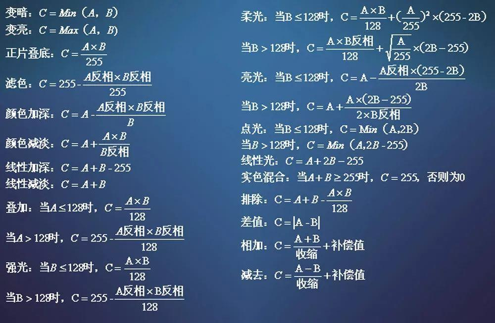
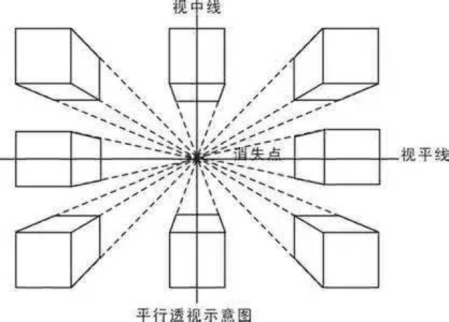
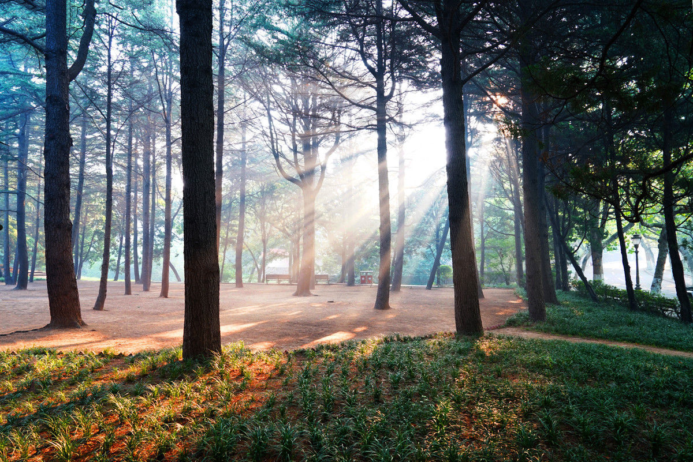

# PS基础教程

## 自定义快捷键

自定义快捷键：`CTRL`+`shift`+`alt`+`k`

内容识别填充：`CTRL`+`alt`+`F5`

选区拓展：`CTRL`+`shift`+`=`

收缩选区：`CTRL`+`shift`+`-`

置入嵌入对象：`CTRL`+`alt`+`[`

置入链接的智能对象：`CTRL`+`alt`+`]`

打包：`CTRL`+`shift`+`p`

高斯模糊：`CTRL`+`shift`+`alt`+`g`

动感模糊：`CTRL`+`shift`+`alt`+`d`

## 界面

主要分为以下几个栏目：

- 菜单栏
- 选项栏
- 工具栏
- 画板
- 等等

## 文档

### 快捷键

新建文件：`CTRL`+`N`

新建图层：`CTRL`+`SHIFT`+`N`

打开文件：`CTRL`+`O`

关闭文件：`CTRL`+`W`

保存文件：`CTRL`+`S`

另存为：`CTRL`+`SHIFT`+`S`

以网页格式存储：`CTRL`+`SHIFT`+`ALT`+`S`

### 新建预设

常用分辨率设置：

根据不同的情况设置不一样的分辨率，来满足对应需求

### 图像文件设置

图像大小设置：`CTRL`+`ALT`+`I`

画布大小设置：`CTRL`+`ALT`+`C`

像素计算公式：

## 软件设置

### 首选项

快捷键：`CTRL`+`K`

暂存盘设置：即临时文件存储位置的设置

历史记录：操作历史记录

自动保存设置：文件处理 -> 文件存储选项

快捷键设置：`CTRL`+`SHIFT`+`ALT`+`K`

## 批量/自动化操作

### 动作命令

点击录制小图标，进行操作，操作完成后，点击停止录制，记录操作，再点击播放小图标，来实现自动化效果

### 批处理命令

### 脚本

#### 图像处理器

## 图层

### 快捷键

合并图层：`CTRL`+`E`

图层向上移动：`CTRL`+`]`

图层向下移动：`CTRL`+`[`

复制图层：`CTRL`+`J`也可以按住`ALT`移动鼠标来复制图层

删除图层：`DEL`

视图放大：`CTRL`+`+`

视图缩小：`CTRL`+`-`

抓手工具：`H`或`空格`

缩放工具：`Z`

### 图层过滤

利用筛选，快速找到想要找的图层

### 图层锁定

用来保护处理完成，不需修改的图层

#### 图层链接

用于整体的编辑操作，如移动、自由变换等操作

### 图层编组

快速编组快捷键：`CTRL`+`G`

取消编组：`CTRL`+`SHIFT`+`G`

图层合并（向下合并）：`CTRL`+`E`

保留图层合并（向下合并）：`CTRL`+`ALT`+`E`

盖印图层：`CTRL`+`ALT`+`SHIFT`+`E`

### 图层复合

常用于文件备份

### 图层剪切蒙版

快捷键：`CTRL`+`ALT`+`G`

注意：被嵌入的图层一定要放在上方

### 图层样式

双击图层边缘弹出图层样式

### 智能对象

单一图层，可以转化多次智能对象

直接双击图层缩览图，直接进入智能对象编辑区域

#### 通过拷贝创建新的智能对象

拷贝出来的智能对象，修改原智能对象保存好后，或拷贝的智能对象，对应的智能对象也会跟着改变

#### 嵌入智能对象

#### 链接智能对象

可以用打包功能导出链接的智能对象

嵌入和链接可以相互转换

### 混合模式

基色与混合色-->结果色

可以通过新建图层，将原有混合模式的效果进行合并，形成新的图层，方便后期添加更多的效果

#### 计算公式

#### 基础型

##### 正常模式

不参与直接混合

##### 溶解模式

改变图层透明度，混合色会融入其中，产生类似颗粒的效果

#### 去亮型

##### 变暗模式

对比基色与混合色的亮度，溶合成亮度较暗的颜色

##### 正片叠底

亮色会被过滤，溶合成新的颜色，在变暗的情况下，显示更多的细节

##### 颜色加深

在变暗的情况下，对比加强

##### 线性加深

变暗的效果更加明显

##### 深色模式

不会产生新的颜色，溶合后，会选用较暗的颜色

#### 去暗型

##### 变亮模式

与变暗相反

##### 滤色模式

深色被过滤，溶合成新的颜色

##### 颜色减淡

变亮的效果更加明显

##### 线性减淡

变亮的效果更加明显

##### 浅色模式

浅色被过滤，溶合成新的颜色

#### 溶合型

##### 叠加模式

效果弱于正片叠底，弱于滤色模式，趋于两者之间（根据基色来判断）

##### 柔光模式

与中性色做对比，溶合成新的颜色，溶合强度较低（根据混合色来判断）

##### 强光模式

与中性色做对比，溶合成新的颜色，溶合强度较强（根据混合色来判断）

##### 亮光模式

与中性色做对比，溶合成新的颜色，溶合强度强（根据混合色来判断）

##### 线性光

与中性色做对比，溶合成新的颜色，溶合强度最强（根据混合色来判断），相当于线性加深和线性减淡的结合体

##### 点光模式

替换暗的颜色或替换亮的颜色

##### 实色混合

修改混合色的填充度，来增强画面的对比

#### 色差型

##### 差值模式

混合色与基色中，亮度较大的值与中性值相减，得到结果色

##### 排除模式

效果比差值要弱，对比度也较低

##### 减去模式

##### 划分模式

#### 调色型

##### 色相

用基色的明度、饱和度，以及混合色的色相，创建结果色

##### 饱和度

用基色的明度、色相，以及混合色的饱和度，创建结果色

##### 明度

用基色的饱和度、色相，以及混合色的明度，创建结果色

##### 颜色

用基色的明度，以及混合色的饱和度、色相，创建结果色

多用于人物调色，或其他商品上色等

## 图像与画布

### 裁剪工具

快捷键：`C`

调整画布大小：`CTRL+ALT+C`

调整图像大小：`CTRL`+`ALT`+`I`

#### 裁切

### 辅助功能

#### 屏幕模式

快捷键：`F`进行切换，一般还是以标准模式为最佳

#### 显示额外内容

快捷键：`CTRL`+`H`

#### 标尺

快捷键：`CTRL`+`R`

## 基础工具

### 移动工具

快捷键：`V`

特性1：能够通过拖拽，跨文件进行复制图层

自动选择：自由选择文件内的图层来实现移动

按住`SHIFT`来移动图层，只能在水平和垂直方向移动

按住`ALT`来移动图层，能够复制该图层

### 选框工具

快捷键：`M`

按住`SHIFT`来划定选区，会形成正方形、圆形等规则图形选区

按住`ALT`来划定选区，则是以中心点来划定选区

取消选区：`CTRL+D`

#### 选区选项

-   新选区
-   合并选区
-   从选区减去
-   选区交叉

#### 选区羽化

使选区边缘柔和过渡

羽化快捷键：`SHIFT`+`F6`

### 魔棒与套索工具

#### 套索工具

快捷键：`L`

##### 多边形套索工具

一般用于规则图形、棱角分明的图形抠图

##### 磁性套索工具

会自动吸附边缘来选择选区，但并不是非常精准，尤其是在色差不明显的边缘

#### 魔棒工具

快捷键：`M`

参数设置：

##### 快速选择工具

修改画笔选项参数，来进行选择

### 历史工具

还原上一步(消除记录)：`CTRL`+`Z`

还原上一步(保存记录)：`CTRL`+`ALT`+`Z`

创建历史文档：用于操作备份文件

创建新快照：历史操作记录存档

### 画笔工具

快捷键：`B`

参数设置：

按住`shift`键会将轨迹变成直线

按住`alt`键来吸取颜色

按住`alt`键来，按住鼠标右键，水平移动鼠标来改变画笔大小，仅适用于`Windows`

利用左右中括号键来改变画笔大小

流量与透明度的区别：<mark>透明度无法叠加，流量可叠加</mark>

##### 制作画笔

编辑-->定义画笔预设-->存储画笔

#### 画笔面板

快捷键：`F5`

#### 混合器画笔工具

一般用于手绘（水彩、油画）

#### 铅笔工具

使用设置与画笔工具类似

### 橡皮擦工具

快捷键：`E`

用于擦除图层上的像素，使用设置与画笔工具类似

在工作尽量避免使用

##### 背景橡皮擦

##### 魔术橡皮擦

自动擦除相同颜色的区域

### 仿章工具

快捷键：`S`

### 修复画笔工具

快捷键：`J`

##### 修补工具

##### 内容感知移动工具

一般用于添加图层上原有的复杂元素

### 红眼工具

消除人像中眼睛的不正常发色（红眼）

### 模糊工具

模糊、锐化、涂抹

### 减淡加深工具

快捷键：`O`

### 油漆桶工具

快捷键：`G`

填充命令：`SHIFT`+`F5`

### 渐变工具

快捷键：`G`

渐变工具选项：

### 自由变换工具

快捷键：`CTRL+T`

再次变换：`CTRL+SHIFT+T`

再次变换复制：`CTRL+SHIFT+ALT+T`

按住`alt`键，并用鼠标选择参考点（轴心）

按住`CTRL`键，并在点上进行操作，进行扭曲变换

### 钢笔工具

快捷键：`P`

是基于贝塞尔曲线原理来实现的

按住`ctrl`键，切换为直接选择工具

#### 路径

创建多个路径层，方便后期管理、操作

##### 路径操作与对齐

##### 矢量蒙版

蒙版图层只能用矢量工具来调整细节

栅格化能够转化为图层蒙版

一个图层，可以矢量蒙版和图层蒙版同时存在

#### 形状

与路径模式操作类似，但其自带填充和描边

形状图层可以进行属性复制

#### 选择工具

快捷键：`A`

按住`CTRL`键来实现下方两种工具之间的切换

##### 路径选择工具

对路径进行移动、复制（按住`alt`键）、变换

##### 直接选择工具

对选中的单独锚点，进行移动、编辑

#### 曲线绘制

##### 自由钢笔工具

用于绘制自由曲线

选中磁性属性，会吸附于边缘，方便后期调整

##### 转换点工具

曲线点转换为角点，角点转换为曲线点

##### 标准曲线绘制

- 按住鼠标左键，进行拖拽，绘制曲线

- 按住`alt`键，调节控杆一端的曲率

- 按住`alt`键，靠近锚点，调节控杆只有一端

- 按住`shift`键，调节控杆固定角度

- 用直接选择工具，按住曲线边缘，来改变曲线的形状

### 选区

反向快捷键：`CTRL`+`SHIFT`+`I`

羽化：能够制作出边缘比较柔和的图像（快捷键：`SHIFT`+`F6`）

快速建立绘制完成的路径选区：快捷键`CTRL`+`ENTER`

平滑：修改边缘圆角大小

拓展与收缩：修改选区边缘大小

### 通道、蒙版

#### 通道

Alpha通道（透明通道）：记录透明度信息的特殊图层，显示的黑色为透明，白色为不透明，灰阶（1-254）为半透明

按住`CTRL`键，鼠标点击，载入选区

### 图层蒙版

蒙版黑色表示透明，白色表示不透明，灰色表示半透明

##### 快速蒙版

选择选区后，按住`Q`键，用画笔来调整选区

### 文字工具

快捷键：`T`

文字图层可以转化为形状图层，转化为路径

点文本与段落文本可以相互转换

#### 文字工作选项

对于不同大小的字体而言，大字体使用平滑效果，小字体则不适用抗锯齿效果

##### 文字两端对齐

全选文字内容，按快捷键`Ctrl` + `Shift` + `J`

#### 在路径上填写文字

文字工具在路径上点按，会形成沿着路径的文字内容

#### 文字蒙版

和快速蒙版类似，能够快速建立一个文字的选区

### 标尺工具

快捷键：`I`

只要用于测量

### 计数工具

用于画面上元素的计数

### 库

窗口-->库

用于存储、分享、协作的资源库

## 滤镜特效

有些特殊图层（文字），需要转化为智能对象，才能使用一些特殊滤镜

### 动感模糊

一般用于运动感的图片（如体育领域）

### 智能滤镜

### 自适应广角

一般用于修正鱼眼镜头拍摄的图片，把它转为正常图片

### 滤镜库

### 水墨效果

-   将图片转成黑白，将图层转为智能对象
-   滤镜库-->艺术效果-->底纹
-   复制图层，图层混合模式改为实色混合，调整不透明度，原图层也调整不透明度
-   最后用蒙版擦除多余的部分，并将白底创建成画布，用滤镜库中的纹理效果来实现

### 雕塑效果

-   抠图等方式抠图
-   将黑色等比较暗的颜色（如头发、颜色），用画笔涂亮一些
-   利用黑白调整图层，变成灰度图片，利用曲线调暗，转化为智能对象
-   添加滤镜库效果（塑料包装、龟裂缝），调试后得到初步效果

### 液化效果

快捷键：`Ctrl `+ `Shift` +` X`

### 查找边缘

一般用于模拟手绘的效果

### 等高线

根据颜色的深浅（色阶），出现的类似闭合的曲线效果

### 模糊类滤镜

##### 场景模糊

可以灵活调整不同区域的模糊程度

#### 光圈模糊

模拟相机的光圈效果

#### 倾斜偏移

一般用于大场景的模糊过渡效果

### 模糊

#### 模糊、进一步模糊

#### 高斯模糊

#### 表面模糊

#### 特殊模糊

#### 形状模糊

#### 动感模糊

一般用于有运动感，或者有活力的人物图片（如奔跑）

#### 径向模糊

### 扭曲类滤镜

#### 波浪

#### 波纹

#### 水波

#### 挤压

#### 极坐标

#### 置换

可以用于替换花纹之类的图像，常用于服装花纹的嵌入

### 杂色

### 锐化类滤镜

效果与模糊类滤镜相反

### 高反差保留

一般用于人物的美化（如祛痘、美白）

 ## 色彩基础

### `RGB`模式

三基色（红、绿、蓝）组成的基础颜色显示，选择8位模式，可显示（对应描述）`2^24`种颜色

#### 吸管工具

快捷键：`I`

吸取颜色作为前景色

### 色彩三要素

#### 色相

#### 明度

调节发光量，加入额外的白光

#### 饱和度

可以看做是增加多少中性灰，从而改变颜色的鲜艳程度

### `CMYK`模式（印刷色彩模式）

### 位图模式

只记录（**黑白**两种颜色）信息的模式

其他模式转化为位图模式，需要先转化为灰度模式，再进行转换

### 灰度模式

只记录（**黑白灰**三种颜色）信息的模式（灰度值是按百分比计算）

只有亮度对比度，更能够直观观察明暗

`Ps`旧版与新版的区别（亮度/对比度）

### 索引模式

### lab模式

通道为明度、`a`、`b`三个通道

用于调色比较方便

### 色阶

快捷键：`CTRL`+`L`

直方图横坐标代表像素发光强度（黑、灰、白）

直方图纵坐标代表每个颜色像素分布的多少

#### 调整色阶

合并黑场/白场（左右滑块）

改变黑场和白场的比例（中间滑块）

#### 输出色阶

调整明暗对比度来最终输出

### 调整图层

对下方所有图层起调整作用（色阶、曲线、饱和度等相关效果）

若只想影响单一某个图层，则将该调整图层添加剪切蒙版。

按住`ALT`键鼠标在两图层中间位置左键点按

### 曲线

快捷键：`CTRL`+`M`

拉动曲线往下压则变暗，往上抬则变亮

操作顺序：

先调节两级的滑块

添加控点调节曲线

### 色彩平衡

快捷键：`CTRL`+`B`

### 照片滤镜

图像——>调整——>照片滤镜

### 通道混合器

图像——>调整——>通道混合器

### 颜色查找

图像——>调整——>颜色查找

可以套`lut`后再进行微调

### 可选颜色

### 反相

快捷键：`CTRL`+`I`

选区反相：`CTRL`+`SHIFT`+`I`

效果生成色 = `(255-R,255-G,255-B)`

### 色调分离

根据色阶来分离颜色

一般在印刷方面运用较多

### 阈值

根据色阶的值来调整阈值，所选的值，小于该值就会变为黑色，其余变为白色

<mark>可以根据阈值，在通道中选出特定选区，再做色彩处理</mark>

### 渐变映射

一定程度上方便调整黑白照片，上色

### 去色方式

-   将饱和度降到最低
-   用通道混合器选择单色
-   去色（快捷键`CTRL`+`SHIFT`+`U`）
-   转为灰度模式
-   `lab`模式删除`a`，`b`通道
-   渐变映射，选择黑白渐变
-   黑白（快捷键：`CTRL`+`SHIFT`+`ALT`+`B`）

### 匹配颜色

一般用于照片颜色的对比匹配，需要调色的照片，匹配一张符合的照片色调，再进行微调

此操作会损耗原照片的细节、颜色，一般不用于精修

### 颜色替换

### 自动色调

快捷键：`CTRL`+`SHIFT`+`L`

### 自动对比度

快捷键：`CTRL`+`SHIFT`+`ALT`+`L`

### 自动颜色

快捷键：`CTRL`+`SHIFT`+`B`

### 应用图像

### `HDR`色调

### 阴影/高光

## `Camera RAW`(照相机滤镜)

快捷键：`CTRL`+`SHIFT`+`A`

## 抠图基础

1. 魔棒工具配合快速选择工具进行抠图
   1. 【一般扣取相对简单的图形】

2. 钢笔工具进行精细抠图
   1. （配合`alt`增减锚点、移动手柄,`ctrl`（小白工具移动锚点位置））
   2. 扣完之后，调出选区`ctrl` + `enter`,再`ctrl`+`j`
   3. 复制到新图层【一般扣去相对复制，不规则图形，但相对层次分明的图形（如汽车）】

3. 用套索工具勾出大概轮廓
   1. 建立图层蒙版，再用画笔工具，进行简单涂抹，使边缘更加清晰
   2. 再点击**选择并遮住**,跳出工具栏，选择调**整边缘画笔工具**，进行边缘细致涂抹，【扣取有动物毛发，或者人像的图像】

4. 选择**通道**，选择对比最强的通道（黑白对比最明显的通道）
   1. 复制该通道作为备份，然后调出色阶`ctrl`+`l`，拉动两边的滑块向中央靠拢，调整到合适的阶段
   2. 再用画笔把不需要抠除的地方进行涂抹，或者用钢笔工具抠出边缘
   3. 完成后，按住`ctrl`,鼠标点击该通道，跳出选区
   4. 再回到图层，`ctrl`+`j`复制选区，最后用减淡工具将透明的婚纱刷白【婚纱（新娘头发不发散聚集在一起）、或有透明元素的图像】

5. 背景为黑的光效，直接用混合模式改为滤色，直接抠出

### 人像抠图

#### 快速人像抠图

一般对于背景不分明的图片，一般用快速选择工具，抠出大致轮廓，点击选择并遮住。

调整上述参数：

选择合适的参数（半径、平滑、羽化、移动边缘、净化颜色），调整到合适的效果后，利用边缘调整画笔和画笔工具，来进行细节涂抹

得到最终的效果后，输出选择带有蒙版的文档

#### 蒙版抠图

一般用于扣取出一些特殊效果的图像

### 复杂抠图

#### 头发与毛发的抠图

##### 色彩范围

选择-->色彩范围

在选择类的工具，右击弹出色彩范围

一般用于色彩比较分明的图片来操作

#### 半透明材质抠图（玻璃、水杯）

##### 通道抠图

选择最亮（白色）最多的通道，进行复制、编辑、操作来实现抠图

#### 计算

### 照片拼版

#### 基础设置参数：

一寸照片尺寸：2.5*3.5cm

分辨率：300

颜色模式：最好是`cmyk`

1. 完成准备工作后，将想要的图片嵌入新建的文件中，利用自由选择工具，抠出背景，建立图层蒙版，新建底色图层。

2. 需要更换服装的话，则将准备好的服装元素嵌入到文件中，调整后，使人物看上去不需要调整。

3. 保存文件（`psd`格式、`jpg`格式）

4. 新建`A4`大小的`psd`文件

5. 添加标尺，预留一定的出血（边距），将图片图层进行描边，大小设置为5像素左右

6. 复制图片进行对齐排列，排好整个页面

## 精修基础

为什么要修图：

1. 做工不完美（制作工艺、结构问题）
2. 物品瑕疵（脏点、污渍、瑕疵、指纹）
3. 拍摄问题（光线统一、色彩校正、形体矫正、摄影穿帮）

修图的条件：

1. 大分辨率（尺寸大、分辨率大）
2. 光影明确（产品有明显的光照方向和光照类型）
3. 结构清晰

修图的内容：

### 三大面

受光面（光照越强，距离越短）、测光面、背光面（明暗灰）

### 五大调

高光、明暗交接、暗部、反光、投影

### 操控变形

编辑-->操控变形

一般用于处理材质、物料形态变化问题

### 透视变形

实现透视效果

### 观察组

黑白图层用来观察

曲线来调整（观察）明暗关系

### 中性灰修图

新建图层，填充50%的灰色，将图层模式改为柔光（屏蔽灰色），使用黑白画笔进行光影的处理（白色提亮、黑色加暗）

缺点：会产生掉色。

解决方式：新建图层，改为颜色模式（图层混合模式），吸取颜色进行补色

补色方式：用曲线拉动，观察色块分布，找到主色，以及掉色情况（色相饱和度拉满，观察明暗、颜色变化）

### 铺光

形体的固有色及具体的明暗关系

1. 明确产品有没有受到环境的影响，产生颜色的偏差（排除干扰）
2. 先将产品去除色彩（已知产品本身的颜色的基础上）【用黑白模式或色相饱和度来去色】
3. 明确光照（光从哪里来、有几盏灯、光线强弱及分布）：判断光源的强弱，分析光源的照射方向
4. 分析单侧光（单边光照特别强，无辅助光，从左到右，有明显的渐变效果）、两侧光（有明显的两侧光照，两侧的光有强度区别或差不多）、正面光（平光状态，中间亮，两侧弱）

### 调色及修饰（画面整体质感统一）

决定画面统一的不是色彩，而是黑白（要在黑白明暗的基础上来建立）【物体在光照下，会产生色相和饱和度的改变】

>[!note]
>	即：越亮越接近白色，越暗越纯，饱和度越高

#### 流程

1. 建立黑白关系，观察黑白差异（每一个颜色的黑白值是不同，体现出明暗的不同）【用黑白图层】

2. 判断画面是否存在光源（无统一光源，就以产品标准设定光源）

3. 建立画面光源

   1. 定光（确定光源所在位置，确定画面的光照形态）

      1. 顶光
      2. 背光
      3. 侧光（光源设定在画面的前侧方，且带有一定的角度）

   2. 分面（确定物体的明暗灰）

      一般用曲线工具来实现明暗效果，但单纯调整中间调会影响颜色的饱和度（提亮削弱，压暗增强）

      1. 受光面
      2. 测光面
      3. 背光面

4. 判断光影的表现（物体在光照下，会产生明暗灰三面）【如果没有特殊要求（即光源在高点），一般会把顶面设置为最亮】

5. 判断光影衰减（建立在光的基础上，与结构高低、远近有关）【一般来说光线越强，越靠近光源越亮，越远越暗】

6. 色彩统一

   1. 分析色调（暖色、冷色）
   2. 分析主色和装饰色（各种颜色的组成部分）
   3. 工具的使用
      1. 改色（色相饱和度【主要适用于单一色相】
      2. 色相饱和度配合色彩平衡【去色再上色(灰色上色，保留原素材的高光、阴影、中间调)】
      3. 通道调色（可选颜色）
      4. 偏色（在色彩在原基础上进行修改）【色彩平衡】
      5. 精准通道调色（根据素材的色彩通道进行选择，再进行色彩的调整）【可选颜色】

### 人像精修

简单人像精修流程：

1. 修补工具（污点画笔工具等），修掉脸上的杂质（痘、斑、疹），完成后复制一个图层【祛斑】
2. 反相图层`ctrl`+`i`,图层混合选项改为线性光，选择滤镜-->其他-->高反差保留，再到滤镜-->模糊-->高斯模糊，加上一个图层蒙版，把不需要磨皮的地方用画笔涂抹干净，【磨皮】
3. 选择曲线，对画面调亮（一般来说是变亮，更有美白效果），曲线图层添加蒙版
4. 用白色、透明度较低的画笔，在高光的位置进行涂抹，再添加一个曲线调暗，添加蒙版用白色、透明度较低的画笔，在暗色的位置进行涂抹【处理明暗关系】
5. 也可以用中性灰来进行类似操作
6. 再进行嘴唇（描红），牙齿（美白），眼睛（加深、加黑）

### 丁达尔效应

自然界中场景的一种透光场景效果：

1. 提取高光：`ctrl`+`alt`+`2`
2. 复制高光到新图层（多复制几层），再进行合并
3. 选择滤镜-->模糊-->径向模糊，设置参数，模糊方式该为缩放，品质改为最好，数量选择较大的值，根据画面的光源，调整中心模糊的位置，与原图相对应

### 产品精修流程

1. 观察产品

2. 勾勒产品轮廓

3. 添加光影效果

​		一般产品（瓶罐）布光轮廓

4. 修补瑕疵

## 立体基础

### 视平线

- 物体能看到顶面，则视平线在物体上方，只能看到正面则视平线在中间，能看到底部则视平线在下方
- 物体越接近视平线，顶部或地面就越扁平，看到的面积就越来越少
- 越远离，可见面越多，圆弧弧度越大

### 消失点

- 消失点是寻找视平线唯一的依据

- 根据透视类型的不同，视平线上可以有不同的消失点

- 视平线上可以有无数个消失点，但需要保证所有的消失点再同一条视平线上

### 透视

#### 视中线

- 一个画面有且只有一个视中心
- 是观察视角的中心
- 在一点透视内与视平线消失点垂直相交
- 所有的消失点或者Y轴是统一的

#### 一点透视（平行透视）

- 所有的物体X轴平行，Y轴垂直，只有Z轴纵深产生远近变化

- 一点透视只有一个消失点

#### 两点透视

- 画面中有两个消失点（成角透视）

- 元素呈角度摆放

- 两点透视有视中线，但无法判断发现

- <mark>两点透视产生镜头畸变时</mark>，Y轴会产生倾斜，所有Y轴都会集中于一点，会变成三点透视，而第三点为视中线

#### 圆形透视

- 圆形透视无法通过Z轴参考查找视平线，只能通过形体的可见面进行预估
- 假设判断方式（将圆判定为方块，【方块和圆设定相同大小，用来与实物进行弧度对比】如果匹配之后得到结果不同，则是物体产生了畸变，需要进行矫正）

#### 舞台设定

- 无参考时，需要自己决定，根据构图来决定视平线
- 有参考时，根据场景的透视为参考，选择合适的素材进行匹配，根据产品的视平线来进行搭建

#### 光影衰减

#### 光效制作

一般用的工具： 

滤色（高饱和度高明度）

线性减淡（高饱和度降低）

​	冷凝光

​		冷光（外圈蓝色、内圈青色）

​		暖光（外圈橙色、内圈黄色）

叠加	

​	追加色彩

## 合成基础

透视工具：快捷键：`ctrl`+`alt`+`shift`

快速剪切蒙版`ctrl`+`alt`+`g`

## 调色基础

常用调色工具：

- 色相饱和度
- 色彩平衡
- 曲线
- 颜色查找

## 字体效果

### 海拔标题字

- 更好表现画面氛围
- 更好凸显画面的情绪
- 更好表现画面中的文字内容

#### 扁平型

凸显品牌调性和常规页面中使用较多

- 选择好的字体、做好梯度差异（灰度、颜色、大小、粗细）即可表现
- 处理好黑白关系（不要与页面脱节）

#### 立体型

##### 厚度的体现

常规厚度字体：

1. `CTRL`+`T`,往想要移动的方向移动一个像素
2. 三键（`ctrl`+`shift`+`alt`）+`T`,多按几次来确定厚度

有透视的厚度字体：

1. `CTRL`+`T`,锁定长宽比例，再移动重心,到消失点调整长宽比例（一般为99.7%）
2. 三键（`ctrl`+`shift`+`alt`）+`T`,多按几次来确定厚度

